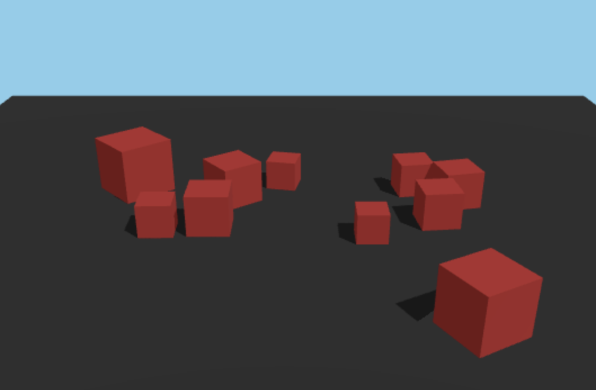

# **Simulación Física Interactiva con Three.js y Ammo.js**

Autor: **Francesco Faustino Greco**


---

## **Índice**

- [Introducción](#introducción)
- [Estructura del Proyecto](#estructura-del-proyecto)
- [Inicialización de Three.js](#inicialización-de-threejs)
- [Motor de Física con Ammo.js](#motor-de-física-con-ammojs)
- [Animación y Sincronización Física](#animación-y-sincronización-física)
- [Fuentes](#fuentes)

CodeSandBox: [LINK](https://codesandbox.io/p/sandbox/strange-agnesi-kxzs52)

---

## **Introducción**

Este proyecto muestra una **escena 3D interactiva** creada con **Three.js** y un sistema de **física realista** implementado con **Ammo.js**.  
Los usuarios pueden:

- Explorar la escena mediante *OrbitControls*.
- Ver cubos caer y colisionar entre sí.
- Hacer clic sobre los cubos para aplicarles un impulso hacia arriba.

El objetivo es integrar renderizado 3D en tiempo real con un motor de física sólido y eficiente.

---

## **Estructura del Proyecto**

El proyecto utiliza:

- **Three.js** para renderizado y manejo de geometrías.
- **Ammo.js** para crear un mundo físico con colisiones e impulsos.
- **OrbitControls** para navegar por la escena.
- **Raycaster** para detectar clics sobre los cubos.
- **Clock y requestAnimationFrame** para sincronizar animaciones.

Componentes principales del archivo:

- `initScene()` → Configura cámara, luces, renderer y controles.  
- `initPhysics()` → Inicializa Ammo.js y crea el mundo dinámico.  
- `createGround()` → Genera el suelo con colisión estática.  
- `spawnCubes()` → Crea cubos con física dinámica.  
- `bindInput()` → Detección de clics e impulsos.  
- `animate()` → Render + actualización física.


<p align="center">
    
</p>

---

## **Inicialización de Three.js**

Se configura la escena 3D con:

- Cámara en perspectiva (60° FOV).
- Fondo celeste.
- Renderizador con sombras.
- Luces ambiental y direccional.
- OrbitControls para navegación.

```javascript
scene = new THREE.Scene();
scene.background = new THREE.Color(0x87ceeb);

camera = new THREE.PerspectiveCamera(60, window.innerWidth / window.innerHeight, 0.1, 100);
camera.position.set(0, 10, 20);

renderer = new THREE.WebGLRenderer({ antialias: true });
renderer.shadowMap.enabled = true;

controls = new OrbitControls(camera, renderer.domElement);
```

---

## Motor de Física con Ammo.js

Se crea un mundo de física completo:


```javascript
const cfg = new AmmoLib.btDefaultCollisionConfiguration();
const disp = new AmmoLib.btCollisionDispatcher(cfg);
const broad = new AmmoLib.btDbvtBroadphase();
const solver = new AmmoLib.btSequentialImpulseConstraintSolver();
physicsWorld = new AmmoLib.btDiscreteDynamicsWorld(disp, broad, solver, cfg);
physicsWorld.setGravity(new AmmoLib.btVector3(0, -9.8, 0));
```
Incluye:
- Configuración de colisiones.
- Detección de contactos.
- Resolución de impulsos.
- Gravedad realista.
- Cada objeto físico está ligado a un THREE.Mesh en la escena.

---

## Animación y Sincronización Física

El loop principal hace:
1. Actualización del mundo físico.
2. Sincronización de posiciones y rotaciones.
3. Renderizado de la escena.
4. Actualización de los controles.

```javascript
const delta = clock.getDelta();
updatePhysics(delta);
renderer.render(scene, camera);
```

Los objetos físicos actualizan sus mesh correspondientes en cada frame:

```javascript
obj.position.set(p.x(), p.y(), p.z());
obj.quaternion.set(q.x(), q.y(), q.z(), q.w());
```

---

## Fuentes

- Three.js Documentation
- ChatGPT para ayuda lingüística
