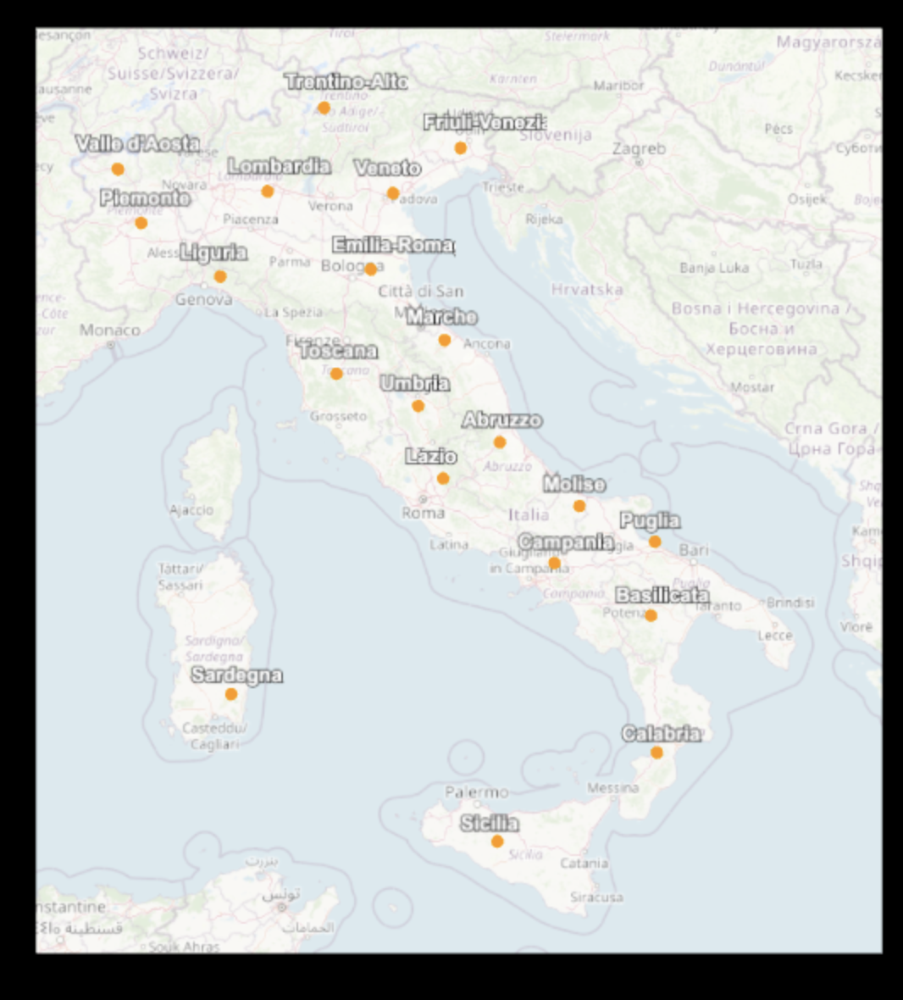

# **Visualización Interactiva de la Mapa de Italia con Three.js**

Autore: Francesco Faustino Greco

---

## Índice

- [Introducción](#introducción)
- [Estructura del Proyecto](#estructura-del-proyecto)
- [Shaders en la Mapa](#shaders-en-la-mapa)
- [Marcadores de Regiones](#marcadores-de-regiones)
- [Animación](#animación)
- [Fuentes](#fuentes)

---

## Introducción

Este proyecto permite visualizar **la mapa de Italia en 3D** usando **Three.js**, con **marcadores para cada región** y un shader aplicado sobre la textura del mapa para generar un efecto visual dinámico.  

Link: [CODESANDBOX LINK](https://codesandbox.io/p/sandbox/practica-8-threejs-rkq2nw?file=%2Fsrc%2FREADME.md%3A22%2C15)

El objetivo es combinar:

- Texturas 2D (mapa de Italia)
- Objetos 3D (esferas y sprites)
- Shaders personalizados para efectos visuales

<p align="center">
  
</p>

---

## Estructura del Proyecto

- **Three.js**: para renderizar la escena 3D.
- **OrbitControls**: para mover la cámara y explorar la escena.
- **ShaderMaterial**: aplicado al plane de la mapa para un efecto de “glow pulsante”.
- **PlaneGeometry**: para la mapa.
- **MeshBasicMaterial y Mesh**: para marcadores de regiones.
- **Sprites con CanvasTexture**: para etiquetas de nombres de regiones.
- **Funciones de utilidad**:
  - `Map2Range`: para transformar coordenadas geográficas a coordenadas de la escena.
  - `normName`: para normalizar nombres de regiones.

Se importan las librerías principales:

```javascript
import * as THREE from "three";
import { OrbitControls } from "three/examples/jsm/controls/OrbitControls";
```

--- 

## Shaders en la Mapa
Se utiliza un shader de fragmentos para aplicar un efecto dinámico sobre la textura del mapa:

```javascript
const material = new THREE.ShaderMaterial({
  uniforms: {
    uTexture: { value: texture },
    uTime: { value: 0 },
  },
  vertexShader: `
    varying vec2 vUv;
    void main() {
      vUv = uv;
      gl_Position = projectionMatrix * modelViewMatrix * vec4(position,1.0);
    }
  `,
  fragmentShader: `
    uniform sampler2D uTexture;
    uniform float uTime;
    varying vec2 vUv;

    void main() {
      vec4 tex = texture2D(uTexture, vUv);
      float glow = 0.7 + 0.5*sin(uTime*2.0 + vUv.x*10.0);
      gl_FragColor = vec4(tex.rgb * glow, tex.a);
    }
  `,
  transparent: false,
});
```

---

## Marcadores de Regiones

Cada región de Italia se representa con:

- Esferas naranjas: usando THREE.SphereGeometry.
- Etiquetas: usando THREE.Sprite con CanvasTexture para mostrar el nombre.

```javascript
Esfera(mlon, mlat, 0.01, 0.04, 16, 12, 0xff9800);
creaEtichetta(rName, mlon, mlat, 0.1);
```

Coordenadas de latitud y longitud se convierten a coordenadas de la escena con Map2Range.

<p align="center">
  
</p>

--- 

## Animación

La animación principal se encarga de actualizar el shader en cada frame:

```javascript
function animate(time) {
  requestAnimationFrame(animate);
  if (mapa.material.uniforms) mapa.material.uniforms.uTime.value = time * 0.001;
  renderer.render(scene, camera);
}
```

Esto genera un efecto continuo y dinámico sobre la textura del mapa.

<p align="center">
  
</p>


--- 

## Fuentes y Documentación

- Three.js Documentation
- OrbitControls
- ChatGPT para ayuda lingüística
